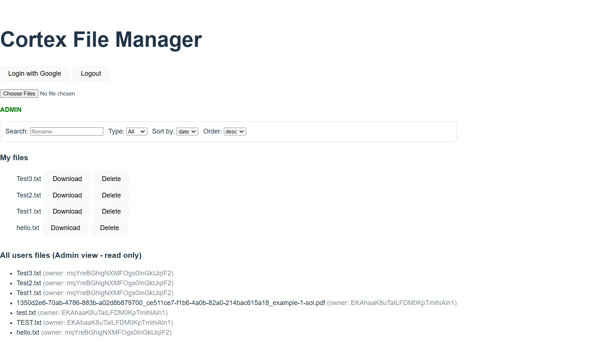

# Cortex File Manager – Backend

**Secure REST API for File Management**

---

## Overview

Backend service for the Cortex File Manager fullstack application. Built with FastAPI and deployed on Google Cloud Run, this service handles authentication, authorization, file management, and secure interaction with Google Cloud Storage.

**Live Deployment**: https://cortex-backend-478973527810.europe-west1.run.app

---

## Responsibilities

- Authenticate users using Firebase ID tokens
- Enforce user-level file ownership
- Enforce admin read-only access to all files
- Handle file upload, listing, download, and deletion
- Generate signed URLs for secure downloads
- Validate file types and requests
- Apply CORS rules for Firebase Hosting and local development

---

## Tech Stack

- Python 3.11
- FastAPI
- Firebase Admin SDK
- Google Cloud Storage
- Uvicorn
- Docker
- Google Cloud Run

---

## Architecture

```
Client (Firebase Hosting)
│
│ Authorization: Bearer <Firebase JWT>
▼
FastAPI Backend (Cloud Run)
│
▼
Google Cloud Storage (GCS)
```

---

## Authentication & Authorization

**Authentication Flow**:
1. User signs in via Google Sign-In on the frontend
2. Firebase issues an ID token (JWT)
3. Token sent in every request: `Authorization: Bearer <firebase-id-token>`
4. Backend verifies token using Firebase Admin SDK

**Authorization Rules**:

| Role | Upload | View Own Files | Delete Own Files | View All Files | Delete Others |
|------|--------|----------------|------------------|----------------|---------------|
| User | V      | V              | V                | X              | X             |
| Admin | V      | V              | V                | V (read-only)  | X             |

Admins are identified by email via environment variable. Authorization is enforced server-side only.

---

## API Endpoints

### GET /

Health check endpoint.

**Response**:
```json
{
  "status": "healthy",
  "service": "cortex-file-manager"
}
```

---

### GET /me

Returns authenticated user details.

**Response**:
```json
{
  "uid": "firebase-user-id",
  "email": "user@example.com",
  "is_admin": false
}
```

---

### POST /upload

Upload one or more files.

**Headers**: `Content-Type: multipart/form-data`  
**Form field**: `files`  
**Allowed types**: `.txt`, `.json`, `.pdf`

**Response**: Metadata for uploaded files.

---

### GET /files

List files with optional filters.

**Query Parameters**:
- `q` – Search by filename (case-insensitive)
- `file_type` – Filter by type (txt, json, pdf)
- `sort_by` – Sort field (date or size)
- `order` – Sort order (asc or desc)

Admins receive files from all users. Regular users receive only their own files.

---

### GET /files/{object_name}/download

Returns a signed URL for secure, time-limited download.

---

### DELETE /files/{object_name}

Delete a file. Only file owners may delete their files. Admins cannot delete files they do not own.

---

## Storage Design

**Why Google Cloud Storage?**
- Native integration with Cloud Run
- Highly durable and scalable
- Simple object-based access model
- Cost-effective for file storage


**Benefits**:
- Strong user isolation
- No filename collisions
- Easy admin traversal
- Secure access control enforced by backend logic

---

## Environment Variables

| Variable | Description |
|----------|-------------|
| `BUCKET` | Google Cloud Storage bucket name |
| `ADMIN_EMAILS` | Comma-separated list of admin emails |
| `ALLOWED_ORIGINS` | Allowed CORS origins |
| `GOOGLE_APPLICATION_CREDENTIALS` | Service account key path (local only) |

**Example** (Local Development):

Create `.env` file in `backend/`:
```env
BUCKET=cortex-file-manager-bucket
ADMIN_EMAILS=admin@example.com
ALLOWED_ORIGINS=http://localhost:5173,https://sixth-tribute-481218-f0.web.app
```

**Important**: Do not commit `.env` or service account keys to Git.

---

## Local Development

**Prerequisites**:
- Python 3.11+
- Google Cloud SDK
- Firebase project with Authentication enabled
- GCP Service Account with Storage Object Admin and Firebase Admin roles

**Setup**:
```bash
cd backend
python -m venv .venv
.venv\Scripts\activate  # Windows
source .venv/bin/activate  # macOS/Linux
pip install -r requirements.txt
```

**Set credentials** (Windows PowerShell):
```powershell
$env:GOOGLE_APPLICATION_CREDENTIALS="C:\path\to\serviceAccountKey.json"
```

**Set credentials** (macOS/Linux):
```bash
export GOOGLE_APPLICATION_CREDENTIALS="/path/to/serviceAccountKey.json"
```

**Run locally**:
```bash
uvicorn main:app --reload
```

Backend available at: `http://localhost:8000`

---

## Deployment (Cloud Run)

**Build & Deploy**:
```bash
gcloud builds submit --tag europe-west1-docker.pkg.dev/PROJECT_ID/cloud-run-source-deploy/cortex-backend

gcloud run deploy cortex-backend \
  --image europe-west1-docker.pkg.dev/PROJECT_ID/cloud-run-source-deploy/cortex-backend \
  --region europe-west1 \
  --allow-unauthenticated \
  --set-env-vars BUCKET=your-bucket,ADMIN_EMAILS=admin@example.com,ALLOWED_ORIGINS=https://your-frontend.web.app
```

Each deployment creates a new Cloud Run revision.

**CORS Handling**:
- CORS enforced via `ALLOWED_ORIGINS` environment variable
- FastAPI CORSMiddleware configuration
- Only explicitly allowed origins may access the API

---

## Security Considerations

- All protected endpoints require JWT authentication
- Authorization enforced server-side
- Admin permissions are read-only by design
- Files isolated by Firebase `uid`
- Signed URLs prevent direct bucket access
- HTTPS enforced via Cloud Run

---

## Troubleshooting

**JWT validation fails**: Ensure `GOOGLE_APPLICATION_CREDENTIALS` points to valid service account key.

**CORS errors**: Verify `ALLOWED_ORIGINS` includes your frontend URL.

**Cloud Storage access denied**: Check service account has `Storage Object Admin` role.

**Environment variables not updating**: Deploy new Cloud Run revision after updating variables.

---
### Secrets & Credentials

No sensitive credentials or API keys are committed to this repository.

- Firebase service account keys are required **only for local development**
- Each developer should generate their own service account key in Firebase
- The key file is excluded via `.gitignore`
- Production authentication uses Cloud Run's default service account

---


## About

This backend was built as part of a Backend-Focused Fullstack Home Task, emphasizing secure API design, cloud-native architecture, authentication & authorization, and production-ready deployment.

**Author**: Noa Y. – Fullstack Developer

---

## Related Documentation

- [Main Project README](../README.md) – Complete system overview
- [Frontend README](../frontend/README.md) – Frontend documentation

---
The Firebase service account key is not included in the repository.
Each developer should create their own service account in Firebase
and set the GOOGLE_APPLICATION_CREDENTIALS environment variable locally.
---

## License

MIT License - see [LICENSE](../LICENSE) file for details.